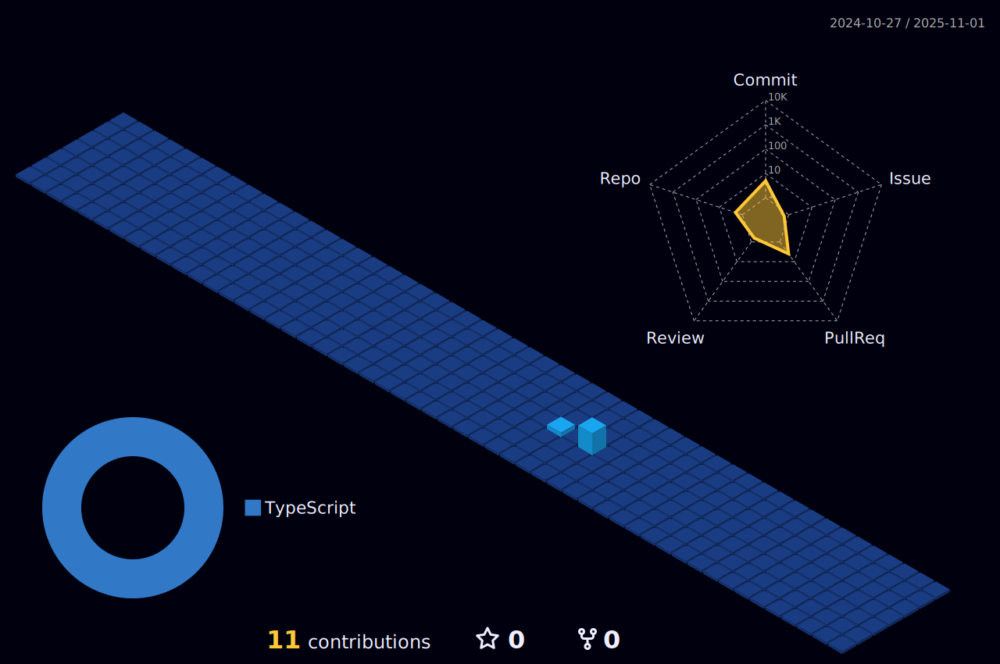

 

# Hi there 👋
Welcome my repository here is you find content about java, spring boot, hibernate, angular
## About Me
Job with Java Developer the approximation 5 years 

### Connect with me at social networks 🤝
- instagram : https://www.instagram.com/williamramos095
- linkedin : https://www.linkedin.com/in/william-ramos-developer/
- twitter : https://twitter.com/william61007781

### 🖥 Experencies at job current 
- Spring boot
- Hibernate
- Jakarta EE
- AngularJS
- Angular

### Students

  
  
  
  
 

### Contacts:

   

   
### Statistics

<a href="https://github.com/williamcostaramos">

  
 

  

 

  

